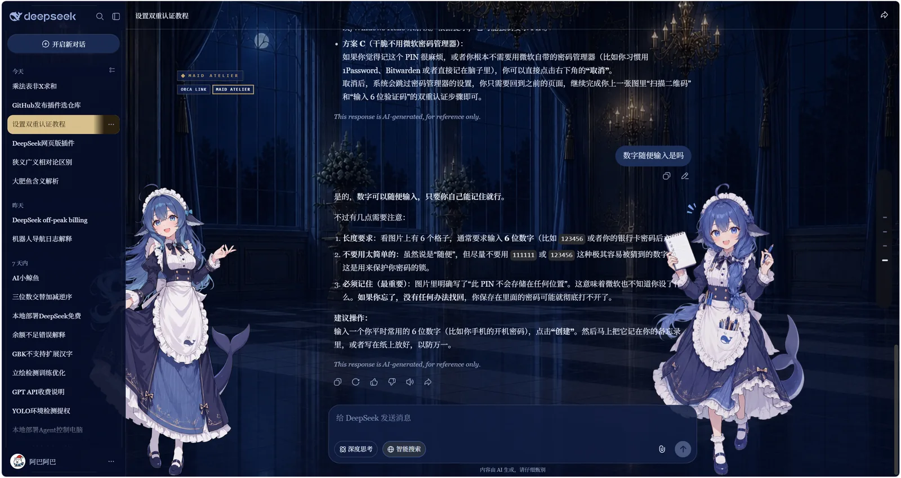

# ORCA LINK / MAID ATELIER · DeepSeek 官网版（Edge 扩展）

把 DSH 上的**两套**皮肤搬到 **chat.deepseek.com**，popup 里一键切换：

| 皮肤 | 来源包 | 视觉语言 |
|---|---|---|
| **ORCA LINK** 虎鲸链路 | `@smalltailqwq/dsh-client-ui-skin-orca-link@0.1.7` | 全局直角契约、直线图标、石墨+暖白、浮动状态角色（10 状态动画） |
| **MAID ATELIER** 深海女仆工坊 | `@smalltailqwq/dsh-client-ui-skin-maid-atelier@0.1.7` | 深海蓝+陶瓷白+柔金、**衬线字体**、宫殿背景、左右双女仆立绘 |

两套都出自 [Small-tailqwq/dsh-deep-whale](https://github.com/Small-tailqwq/dsh-deep-whale)（2316★）。素材、配色令牌、场景图、状态机参数全部取自原皮肤包，逐项对齐后重新实现为浏览器扩展。

> ⚠️ 这不是那两个插件本身。DSH 皮肤是寄生在 DSH 的 Cordis 插件系统 + `data-dsh-*` DOM 契约上的客户端插件（原包 CSS 里 572 处 `[data-dsh-`、289 处 `[data-slot`），chat.deepseek.com 没有插件接口、DOM 也完全不同，所以这里是**同素材同设计的重新实现**。

## 安装（Edge）

1. 打开 `edge://extensions/`
2. 打开左下角 **开发人员模式**
3. 点 **加载解压缩的扩展**，选择本目录（克隆下来的仓库根目录）
4. 打开或刷新 https://chat.deepseek.com/ —— 左下角出现皮肤面板
5. 在面板里点 **ORCA LINK** 或 **MAID ATELIER** 即可切换（**即时生效，无需刷新**）

> Edge 默认不会把新装的扩展固定到工具栏：点地址栏右侧的**拼图图标**，找到本扩展并点**图钉**固定，之后点图标可打开 popup（含「背景兜底透明化」「重置位置」等开关）。

卸载：在同一页面点「移除」。扩展不改站点文件，随删随净。

## 切换皮肤

切换入口有**两个**，设置互通、自动同步：

1. **页面左下角面板**（推荐）：标题 `皮肤 · SKIN` 下两行选项，各带配色预览块与中文说明；当前皮肤有 ✓ 与高亮描边。首次使用会浮出一个「↑ 从这里换皮肤 / 背景」的引导气泡，点选后不再出现。面板可随部件一起拖拽。
2. **工具栏 popup**：点扩展图标，最上方的 **SKIN** 两个按钮。

## 两套皮肤的令牌层

| | orca-link | maid-atelier |
|---|---|---|
| 宿主 `--dsw-*` 覆盖 | 浅 61 / 暗 43 | 浅 47 / 暗 42 |
| `--dsw-alias-bg-base` | 半透明暖白纱 `#faf7f13d` / `#080c1338` | **`transparent`**（宫殿图整层透出） |
| 侧栏 | 暖白 `#faf7f194` | 深海蓝 `#0b1942e0` / `#050d28e6` |
| 强调色 | 石墨 `#4b483f` / ORCA 蓝 `#4d91ff` | 长春花蓝 `#526aa8` / 柔金 `#c5a468` |
| 正文字体 | 跟随站点 | **改成衬线体系**（Georgia / 宋体族） |
| 直角契约 | 是（令牌 + 定向规则两手） | 否（蕾丝圆角语言，扩展里用 `:not(maid)` 隔离） |

全部 **193 项**令牌逐值照搬并有断言守着（见下）。

## 关键发现：两个 DeepSeek 产品共用同一套设计令牌

原皮肤 CSS 里有一整段对 `--dsw-*` 的覆盖——这是 DSH 宿主的令牌命名空间，而 chat.deepseek.com 用的是**同一套**。所以配色不是靠逐个选择器硬凑，而是**整段照搬令牌**，颜色顺着站点自己的变量系统自动流到用户气泡、品牌色、边框、标签、侧栏、菜单、代码块。

## 已移植的功能

| 原皮肤功能 | 本扩展 | 实现方式 |
|---|---|---|
| 宿主 `--dsw-*` 令牌覆盖 | ✅ 104 项 | 逐值照搬（浅 61 / 暗 43），断言逐字节一致 |
| 亮/暗各一对 16:9 场景（空态 Hero / 工作态 Active） | ✅ | 原包 4 张 webp 原图 `1672×941`，640ms 交叉淡化，渐晕层一致 |
| 空态/工作态判定 | ✅ | 按会话 URL（`/a/chat/s/<id>`）+ 消息节点数，替代 DSH 的 `[data-orca-scene]` |
| 亮暗令牌全表（含暗色覆盖） | ✅ | 19 个 `--orca-*` 逐值照搬 |
| 全局直角契约 | ✅ | 令牌侧 `--dsw-radius-*: 0px`（同皮肤）+ 定向 `border-radius: 0` 全域兜底 |
| 页面图标（favicon） | ✅ | 换成原包 ORCA 图标，卸载还原 |
| 状态角色：10 状态 × 8 帧动画 | ✅ | 原图集 `1888×2360`（236px 单元），`800%/1000%` 切片公式 + 80 个逐帧质心补偿 1:1 |
| 状态信号块（10 条文案） | ✅ | 原包 `STATUS_LABELS` 原文 |
| 窄屏收起装饰 / 减少动效 | ✅ | 同原包断点与媒体查询 |
| ~~峰谷定价红绿灯~~ | ❌ 已按需移除 | 那是 DeepSeek **API** 的计费时段提示，网页版免费无意义，见下 |

## 没能照搬的部分

- **皮肤管理器**：原包靠 DSH 的插件花名册与皮肤互斥机制，官网没有宿主接口，改用扩展 popup 的开关。
- **运行时图标重绘**：原包把 DSH 图标库的 SVG 逐条改写成「只用横线/竖线/45°折线」的直线图形。官网图标体系不同，**未实现**——直角契约覆盖了形状语言，但这是实打实的缺口。
- **token 账房 / 轨迹面板 / 设置页接管 / composer 折叠把手**：官网没有对应面板。

## 本版本调整（0.2.9）

- **修复女仆套日间模式侧栏不可读**（真 bug，根因在移植方法上）：
  - 原皮肤把侧栏的**深蓝底与米白字成对**写在作用域选择器 `body[data-dsh-maid-atelier] [class*=sidebarCol]` 上（12 项令牌）；
  - 我的令牌抽取是「把任何作用域的 `--dsw-*` 声明拍平到 `body`，同名只留第一个」——于是这一层被丢掉，侧栏只剩 body 级的深蓝底色 `#0b1942e0`，文字却仍是 body 级的深蓝 `#172347` → **深底深字**，亮色下几乎看不见（暗色下因为 body 级文字本来就是浅色，反而正常，所以只暴露在日间模式）。
  - 修复：按原作照搬这 12 项侧栏作用域令牌（含底色、文字、金描边、滚动条、交互态），选择器对准站点当前侧栏容器 `.b8812f16` / `.dc04ec1d`，并保留原作的 `[class*=sidebarCol]`。
  - **新增对照断言**：直接从皮肤包里抽 `[class*=sidebarCol]` 的声明，逐项核对我的值与原作一致；另加两条断言盯住「侧栏文字不得回落到 `#172347`」「侧栏底色不得透出宫殿」。
- 顺带记一笔方法论教训：令牌抽取**必须保留作用域**，不能拍平——否则像这样"底色搬了、字色没搬"的错，只能靠肉眼在特定主题下发现。

## 本版本调整（0.2.8）

- **修复 0.2.7 误删的「暗金选中会话」**：撤直角契约时，切片脚本以「顶栏下沿」注释为结束标记，而暗金选中规则（`#d8c08c`）正好夹在两者之间，被一并切走。已补回。
- **加一道结构清单测试**：这已是切片脚本第三次吃掉不该吃的内容（前两次：皮肤面板样式 + `.orca-row`；本次：暗金选中）。测试现在会逐条核对 **10 个章节注释**是否在场，以及 4 处关键规则的**实质内容**（防止"注释还在、规则没了"）。
- 现状：两套皮肤都保留站点圆角；暗金选中会话（暗色模式）恢复；侧栏框（虎鲸方括号 / 女仆金框）保持移除。

## 本版本调整（0.2.7）

按使用反馈撤掉了三处「设计上忠实、但用起来不想要」的东西：

- **移除虎鲸链路的侧栏框**（0.2.5 刚加的 18px 直角方括号 + 竖排 ORCA LINK 字标 + 侧栏右缘 spine）。DOM 与样式整体删除。
- **移除女仆套的侧栏金框**（四条渐变金线 + 四枚角饰）。顶 / 底饰带保留。
- **撤掉全局直角契约**：`border-radius: 0` 全域归零规则、`--dsw-radius-*: 0px` 六项令牌、`data-orca-square` 标记与 popup 开关全部移除。**两套皮肤现在都保留站点自己的圆角**（这也是女仆套原本的样子）。
  - 代价要讲清：虎鲸链路的「全直角界面」是原皮肤的核心识别特征之一，这一条现在**不再移植**。令牌保真断言相应改为「浅色 55 项（原 61 项减去 6 项 radius）」，并加反向断言守着。

## 本版本调整（0.2.5）

- **虎鲸链路的侧栏升级**：照搬原皮肤侧栏舞台的三件套（此前只搬了配色与直角，结构没搬）：
  - **直角方括号舞台框**：四个 18px 方括号（原作是八条 `18×1` / `1×18` 的 `--orca-blue` 渐变角线）围住侧栏上部；框内壁一圈 12% 透明度极淡描边，右下角一枚 9px 实心三角角标（对应原作 `:before` / `:after`）。
  - **竖排 ORCA LINK 字标**：`writing-mode: vertical-rl`、字距 `0.42em`、8px 等宽字体，贴舞台框左侧垂直居中，参数与原作一致（暗色下换深色投影）。
  - **侧栏右缘 spine**：每 56px 断一次的 1px 竖虚线，上下各 56px 渐隐遮罩，位置随站点的 `--sider-width` 走。
- 侧栏框改为**两套皮肤共用同一份 DOM**，外观由 CSS 按 `[data-orca-skin]` 区分（女仆仍是柔金四角 + 金线）；顶 / 底饰带依旧只在女仆套显示。

## 本版本调整（0.2.4）

- **修复 0.2.3 引入的样式丢失**：移除信号块时用的切片脚本以「主题字标」注释为结束标记，而皮肤面板样式正好位于两者之间，导致 `.orca-skin-*` 全部规则与基准 `.orca-row` 被一并切走——表现是面板塌成一堆裸按钮、两个选项都带 ✓。
- **补上缺失的测试层**（这才是根因）：此前只测 JS 行为，从不校验 CSS 里是否真有对应规则。新增 `test-css.mjs`：
  - **交叉核对**：`orca.js` 里 `className = '…'` 创建的 16 个 class，必须在 `orca.css` 里有规则；
  - 22 条**基准规则行首锚定**检查（防止被 `某作用域 .x {` 里的片段蒙混过关）；
  - 两套皮肤的令牌块在场、CSS 括号平衡、体积下限；
  - 反向断言：已移除的 `orca-signal-chip` / `orca-pricing` 不许复活。

## 本版本调整（0.2.3）

- **移除「LINK ACTIVE」状态信号块**：原皮肤把它挂在 DSH 侧栏词标旁当一个信号点，搬到网页后它浮在内容之上、挡视野；而状态角色头顶的气泡（`...` / `!` / `?` / `§`）本来就已经表达状态，它是冗余的。相关 DOM 与样式**整体删除**（不是藏起来）。
- 保留：状态角色的十状态动画、逐帧质心补偿，以及 `--orca-lamp-*` 信号色（故障 / 待授权仍用它上色）。

## 本版本调整（0.2.2）

- **皮肤面板加「收起 / 展开」**：一枚 `– 收起` 按钮，收起后整块面板只剩一枚 `▸ 皮肤` 胶囊（标题、两个选项、引导气泡一并收起），再点一下展开；收起状态写进设置，刷新后保持。
- 想彻底不看见部件：orca 皮肤下可在 popup 关掉「状态角色」；要连字标一起隐藏的话说一声，我加个总开关。

## 本版本调整（0.2.1）

- **切换入口重做成「面板」**，解决"那两枚小按钮看不出是干什么的"：
  - 加标题行 `皮肤 · SKIN` + 右侧「点此切换」；
  - 每个选项加**配色预览块**（虎鲸＝石墨/青，女仆＝深海蓝/柔金）与**中文副标题**（虎鲸链路 / 深海女仆工坊）；
  - 当前项加 ✓ 与高亮描边；面板背景改为实底 + 毛玻璃 + 投影，读起来是个控件而不是装饰；
  - **首次使用浮出引导气泡**「↑ 从这里换皮肤 / 背景」，点选后永久不再出现（存在 `chrome.storage.local.skinHintSeen`）；
  - 女仆皮肤下面板自动换成深海蓝底 + 柔金描边。

## 本版本调整（0.2.0）

- 新增第二套皮肤 **MAID ATELIER 深海女仆工坊**：47+42 项宿主令牌、宫殿亮暗背景、左右双女仆立绘、衬线字体、顶/底饰带与侧栏四角金框。
- 直角契约与状态角色用 `:not(maid)` 隔离，避免破坏女仆的蕾丝圆角语言。

## 本版本调整（0.1.4）

- **图标蓝化**（与 DSH 侧的 ORCA 黑鲸图标区分开）：浅色圆角底与描边保持原样，只把**鲸身**由 `#11151b` 改成 DeepSeek 官网蓝 `#3964fe`；鲸身上那个 4px 小方点原本是蓝的（`#086cff`），蓝底上是蓝的会看不见，因此改成白色。
  - 工具栏图标 `icons/icon{16,32,48,128}.png` 与标签页图标 `assets/favicon-deepseek-blue.svg` 用同一份 SVG 渲染，两处一致。
  - 标签页图标另外清掉了站点图标上的 `media` 属性（站点给亮/暗各挂了一条，指向同一个蓝版后 `media` 只会让其中一条失效），卸载时连同 `type` / `media` 一起还原。
  - **想换更深的蓝**：改 `assets/favicon-deepseek-blue.svg` 里那一个 `#3964fe`（官网品牌蓝；暗色版为 `#5686fe`），例如 `#1e40af` / `#2a4fd8`，然后重跑一次渲染脚本即可。
  - 旧的 `assets/orca-link.ico`（黑鲸版）保留未删，需要回退时可直接指回去。

## 本版本调整（0.1.2）

- **夜间模式选中会话改为「古典淡金」**：站点规则是 `._546d736.b64fb9ae { background: var(--dsw-specific-sidebar-nav-item-active-accent) }`，而原皮肤在暗色下把这个令牌覆盖成 `#4d91ff`（ORCA 亮蓝），反馈太亮。现在：
  - 选中行底色 `#d8c08c`、文字 `#2a2110`、行内操作按钮的 mask 转深色；
  - 侧栏容器内同时改写令牌（`-active-accent` / `-active` / `-hover`），站点改版换掉哈希类名时这层仍在；
  - 悬停态一并转成 12% 淡金，避免金色选中旁边闪出蓝色。
  - **换色只改 `src/orca.css` 里那三个值**（注释已标注）。浅色模式未改动。

## 本版本调整（0.1.1）

- **移除「峰谷定价红绿灯」**：原皮肤那盏红绿灯提示的是 DeepSeek **API** 的计费时段（高峰/低谷半价），而 chat.deepseek.com 网页版免费、没有 token 计费概念，留在界面上只会误导。相关代码已整体删除，不是关掉开关：
  - `orca.js` 删掉北京时间换算、高峰窗口 `09:00-12:00 / 14:00-18:00`、20 分钟预警、2026 工作日节假日表与红绿灯挂载逻辑；
  - `orca.css` 删掉全部 `.orca-pricing*` 样式与脉冲动画（91 行）；
  - popup 去掉对应开关。
  - 保留 `--orca-lamp-red/amber/green` 三个令牌——状态角色的「故障 / 待授权」信号色仍在用它们。

## 站点适配层（基于生产 bundle 实证）

扩展用的选择器来自对 chat.deepseek.com 当前生产包（`commit-id=44809ea4` / appVersion 2.5.0）的静态分析，**优先语义类，哈希类只作 fallback**：

| 用途 | 选择器 | 性质 |
|---|---|---|
| 主题机制 | 深色 `body.dark` + `body[data-ds-dark-theme="dark"]`；浅色 `body.light` | 硬编码，稳定 |
| AI 消息正文 | `.ds-markdown` / `.ds-assistant-message-main-content` | 硬编码，稳定 |
| 消息行 | `[data-virtual-list-item-key]` / `.ds-message` | 硬编码，稳定 |
| 输入框 | `.ds-textarea`（当前哈希 `.aaff8b8f` / `._77cefa5` / textarea `._27c9245`） | 语义 + 哈希 |
| 侧栏 | 当前 `.b8812f16`（外层 `.dc04ec1d`，宽度 `--sider-width` 261px） | 哈希 |
| 用户气泡 | 当前 `.fbb737a4`（`--dsw-specific-bubble`） | 哈希 |
| 顶栏 | `.the-header` | 硬编码，稳定 |

背景遮挡的**主凶**是 `body` 自身与聊天底板 `._55ff781`（都吃 `--dsw-alias-bg-base`），令牌层已一并解决。popup 里另有一个 **「背景兜底透明化」**开关（默认关闭）：万一站点改版导致背景重新被盖住，打开它会用「以输入框/侧栏/顶栏为锚点向上标记祖先」的启发式手段强制让出底色。改选择器只需动 `src/orca.js` 顶部的 `ANCHOR_SELECTORS`。

## 验证记录

三组断言全绿，脚本都在 `D:\AI\orca-extract\`：

| 脚本 | 项数 | 内容 |
|---|---|---|
| `test-tokens.mjs` | 15 | **104 项 `--dsw-*` 令牌与皮肤逐值一致**；bg-base 半透明值、侧栏/composer/气泡映射、直角令牌、暗色挂载点 |
| `test-port.mjs` | 15 | 状态行号表、80 个质心补偿、standby 逐帧时长、10 条文案、帧序；图集切片 2 例；**6 项反向断言**确认定价代码已彻底移除 |
| `test-runtime.mjs` | 19 | 用最小 DOM 桩真跑 `orca.js`：启动无异常、场景/部件/角色装配、初始状态 `ready`、红绿灯已不存在、两个观察器回调可执行、帧动画可执行 |

另加 manifest 引用完整性、JS 语法检查、CSS 括号平衡。

## 许可与署名

- 代码：原皮肤为 **MIT**，本扩展实现同样以 MIT 释出。
- **美术资源：CC BY-NC-SA 4.0 —— 禁止商业使用**，需署名、衍生同许可。署名链：
  1. 一创 **上善**（[Pixiv](https://www.pixiv.net/users/62155430) · [Bilibili：上善无形](https://b23.tv/8h5L4xz)）—— 鲸鱼娘角色原作者
  2. 二创 **Small-tailqwq** —— ORCA LINK 皮肤场景、状态图集与 UI 素材
- 素材取自 `@smalltailqwq/dsh-client-ui-skin-orca-link@0.1.7` 的 `assets/runtime/`，原字节打包，未二次压缩。

## 已知限制

- 所有 `._xxxxxxx` 是 CSS Modules 哈希，**站点改版即变**；扩展已尽量依赖语义类与 `--dsw-*` 令牌，哈希失效时的表现是局部观感回落，不会坏页面。
- 直角契约含全域 `border-radius: 0`，比原包的定向规则霸道；不喜欢可在 popup 关掉。
- **已移除峰谷定价红绿灯**（网页版不计费）；若你以后要在 DSH 侧看计费时段，那本来就在 DSH 皮肤里，与本扩展无关。
- 未做活体 DOM 验证（本机无无头浏览器与登录态）；结论来自生产 bundle 静态证据 + 两份第三方样式交叉验证。首次使用如遇局部错位，截图给我即可快速修正。
